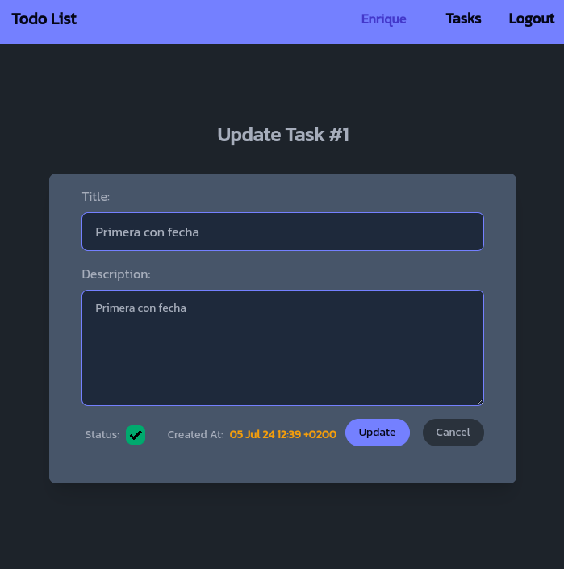
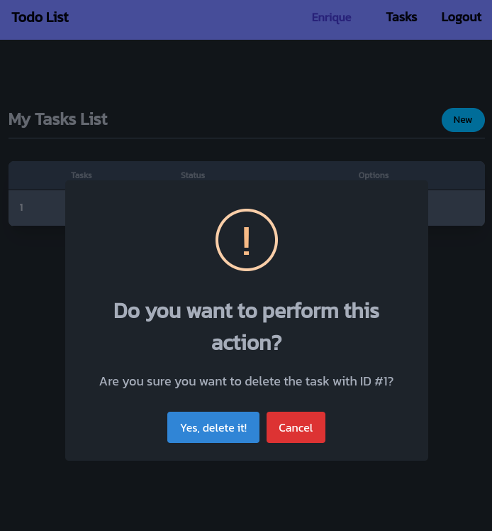
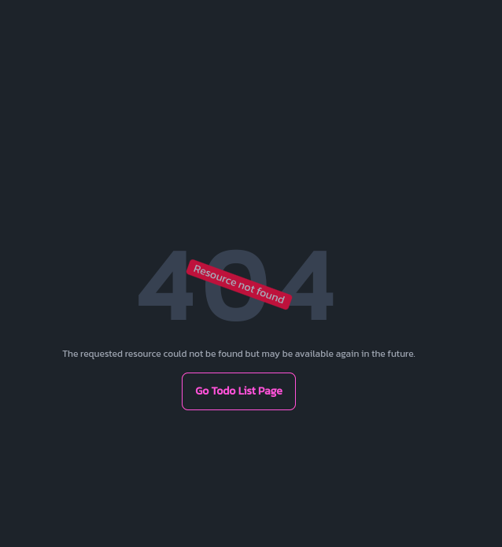

<div align="center">

# Go/Fiber🧬+<span style="color:yellow"></></span>Templ to-do list app with user login and HTMx-powered frontend (Demo)

A full-stack application using Golang's Fiber framework with session-based authentication. Once we are authenticated we can enter a view from which we can manage a list of tasks (list, update and delete). Requests to the backend are controlled by [</>htmx](https://htmx.org/) ([hypermedia](https://hypermedia.systems/) only).

 

</div><br />

>[!NOTE]
>***This application is an clone of this [repository](https://github.com/emarifer/rust-axum-askama-htmx-todoapp) of mine (rust-axum-askama-htmx-todoapp), but made in `Golang`.***

<hr />

### 🤔 Explanation

The application allows us to perform a complete CRUD on the database, in this case SQLite3.

The DB stores both a table with the users and another table for each user's to-do. Both tables are related using a foreign key.

In this application we have used the Fiber framework, which, as it says in its documentation, is "an Express-inspired web framework". This makes creating web applications much easier for people coming from the world of JavaScript. Fiber is a Go web framework built on top of Fasthttp, the fastest HTTP engine for Go. It's designed to ease things up for fast development with zero memory allocation and performance in mind.

Authentication (via session) is done using built-in middleware. On the other hand, a [dependency](https://github.com/sujit-baniya/flash) is also used to handle flash messages.

Finally, using the Fiber framework also allows us centralized error handling.

<br>

>[!IMPORTANT]
>***In this application, instead of using the html/template package (gofiber/template/html, specifically), we use the [a-h/templ](https://github.com/a-h/templ) library. This amazing library implements a templating language (very similar to JSX) that compiles to Go code. Templ will allow us to write code almost identical to Go (with expressions, control flow, if/else, for loops, etc.) and have autocompletion thanks to strong typing. This means that errors appear at compile time and any calls to these templates (which are compiled as Go functions) from the handlers side will always require the correct data, minimizing errors and thus increasing the security and speed of our coding.***

The use of </>htmx allows behavior similar to that of a SPA, without page reloads when switching from one route to another or when making requests (via AJAX) to the backend.

On the other hand, the styling of the views is achieved through Tailwind CSS and DaisyUI that are obtained from their respective CDNs. Likewise, the `SweetAlert2` library is used, a substitute for javascript pop-up boxes. In the same way it is obtained from its respective CDN.

Finally, minimal use of [_hyperscript](https://hyperscript.org/) is made to achieve the action of closing alerts when they are displayed and the action of showing/hiding the password in corresponding text input fields.

>[!NOTE]
>***This application is identical, although much more improved, to that of a previous [repository](https://github.com/emarifer/gofiber-htmx-todolist) of mine, which is developed in GoFiber-template/html instead of [Templ](https://templ.guide/) templating language, as in this case.***

---

## 🖼️ Screenshots:

<div align="center">

###### Todo List Page with success alert & Sign Up Page with error alert:

&nbsp;&nbsp;

<br>

###### Task update page & popup alert based on SweetAlert2:

&nbsp;&nbsp;

<br>

###### Centralized handling of 404 & 500 errors:

&nbsp;&nbsp;

<br>

</div>

---

## 👨‍🚀 Setup:

Besides the obvious prerequisite of having Go! on your machine, you must have Air installed for hot reloading when editing code.

Start the app in development mode:

```
$ air # This also compiles the view templates automatically / Ctrl + C to stop the application
```

Build for production (previously it is necessary to regenerate the templates with the `templ generate` command; see explanation below):

```
$ go build -ldflags="-s -w" -o ./bin/main . # ./bin/main to run the application / Ctrl + C to stop the application
```

>[!TIP]
>***In order to have autocompletion and syntax highlighting in VS Code for the Teml templating language, you will have to install the [templ-vscode](https://marketplace.visualstudio.com/items?itemName=a-h.templ) extension (for vim/nvim install this [plugin](https://github.com/joerdav/templ.vim)). To generate the Go code corresponding to these templates you will have to install the templ CLI:***

```
$ go install github.com/a-h/templ/cmd/templ@latest
```

>[!TIP]
>***And then regenerate the templates with the command:***

```
$ templ generate # The `templ generate --watch` command will watch the project folder to regenerate them every time we make a change to its code.
```

>[!TIP]
>***Review the documentation on Templ [installation](https://templ.guide/quick-start/installation) and [support](https://templ.guide/commands-and-tools/ide-support/) for your IDE.***

---

### Happy coding 😀!!